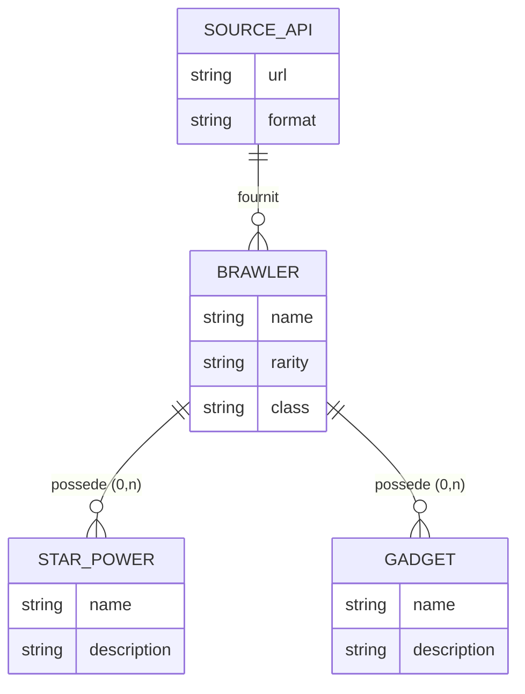
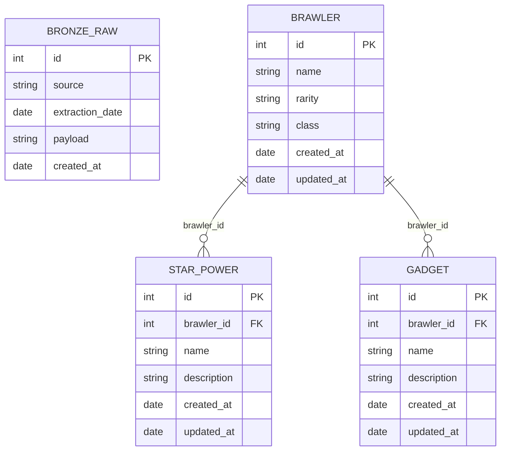
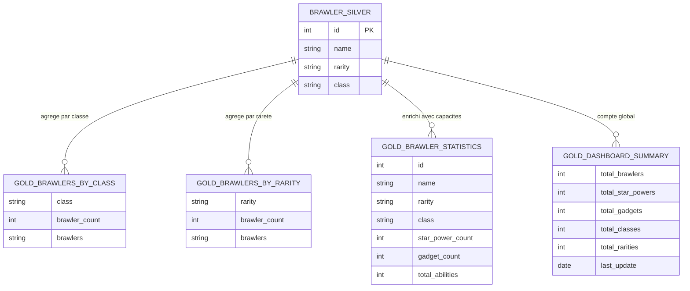

# Brawl Stars Data Mining

Projet de data mining appliqué au jeu **Brawl Stars** (Supercell), développé dans le cadre du cours *Récupération de données & architectures data modernes* à l'ESGI.

Le pipeline suit une **architecture médaillon** (Bronze → Silver → Gold) pour collecter, nettoyer, transformer et visualiser les données issues de l'API publique [Brawlify](https://brawlify.com/).

---

## Sommaire

1. [Architecture générale](#architecture-générale)
2. [Prérequis](#prérequis)
3. [Installation](#installation)
4. [Utilisation](#utilisation)
5. [Description des modules](#description-des-modules)
6. [Modele de données](#modele-de-données)
7. [Modele Gold — Expression des besoins metiers](#modele-gold--expression-des-besoins-metiers)
8. [Visualisations produites](#visualisations-produites)
9. [Structure du projet](#structure-du-projet)
10. [Technologies](#technologies)

---

## Architecture générale

Le projet implémente une **architecture médaillon** en trois couches, chaque couche ayant un rôle précis et une qualité de donnée croissante.

```
API Brawlify (https://api.brawlify.com/v1/brawlers)
        |
        | requête HTTP GET
        v
  [ COUCHE BRONZE ]
  Table : bronze_raw
  Stockage du JSON brut tel que retourné par l'API.
  Données immuables, aucune transformation.
        |
        | lecture du dernier payload JSON
        v
  [ COUCHE SILVER ]
  Tables : brawler / star_power / gadget
  Normalisation, typage, déduplication.
  Données propres et structurées, prêtes à l'analyse.
        |
        | jointures et agrégations SQL
        v
  [ COUCHE GOLD ]
  Vues SQL : gold_brawlers_by_class, gold_brawler_statistics, ...
  Indicateurs métier calculés, agrégations thématiques.
        |
        | requêtes sur les vues Gold
        v
  [ VISUALISATIONS ]
  Graphiques PNG (matplotlib / seaborn)
  Dashboard interactif HTML (plotly)
  Rapport texte (summary_report.txt)
```

---

## Prérequis

- **Python** 3.8 ou supérieur
- **XAMPP** avec le service **MySQL/MariaDB** démarré sur le port `3306`
- Connexion internet (pour appeler l'API Brawlify)

---

## Installation

**1. Cloner le dépôt**

```bash
git clone https://github.com/Bulbabulbe/Api-brawlstar-data-mining.git
cd Api-brawlstar-data-mining
```

**2. Installer les dépendances Python**

```bash
pip install -r requirements.txt
```

Dépendances installées :

| Package | Usage |
|---------|-------|
| `requests` | Appels HTTP vers l'API Brawlify |
| `mysql-connector-python` | Connexion et requêtes MySQL |
| `pandas` | Manipulation des DataFrames pour les graphiques |
| `matplotlib` | Génération des graphiques statiques (PNG) |
| `seaborn` | Styles visuels avancés (heatmap, palette) |
| `plotly` | Dashboard interactif HTML |

**3. Initialiser la base de données**

- Ouvrir XAMPP et démarrer le service **MySQL**
- Ouvrir **phpMyAdmin** : `http://localhost/phpmyadmin`
- Importer le fichier `init_database.sql`

Ce script crée la base `brawl_stars_db`, toutes les tables (Bronze et Silver) et les vues analytiques Gold.

---

## Utilisation

```bash
python main.py
```

Le pipeline s'exécute automatiquement en 4 étapes séquentielles :

```
Step 1: Extract data from API (Bronze layer)
Step 2: Normalize data into tables (Silver layer)
Step 3: Create analytical views (Gold layer)
Step 4: Generate charts and dashboard
Pipeline complete.
```

Les fichiers de sortie sont générés dans le dossier `visualizations/`.
Ouvrir `visualizations/interactive_dashboard.html` dans un navigateur pour consulter le dashboard interactif.

---

## Description des modules

### `main.py` — Point d'entrée du pipeline

Orchestre l'exécution séquentielle des 4 étapes en important et en appelant les fonctions principales de chaque module.

```python
extract_and_store_brawlers()      # Etape 1 : Bronze
transform_bronze_to_silver()      # Etape 2 : Silver
create_gold_views()               # Etape 3 : Gold
generate_all_visualizations()     # Etape 4 : Visualisations
```

Chaque module peut également être exécuté indépendamment via son bloc `if __name__ == "__main__"`.

---

### `extract_bronze.py` — Couche Bronze

**Rôle :** Interroger l'API Brawlify et stocker la réponse JSON brute en base de données.

**Fonction principale :** `extract_and_store_brawlers()`

**Comportement détaillé :**

1. Effectue une requête `GET` vers `https://api.brawlify.com/v1/brawlers` avec un timeout de 30 secondes.
2. Appelle `raise_for_status()` pour lever une exception si le code HTTP n'est pas 2xx.
3. Sérialise la réponse complète en JSON avec `json.dumps()`.
4. Insère une ligne dans la table `bronze_raw` avec :
   - `source` : identifiant de la source (`"brawl_stars"`)
   - `extraction_date` : horodatage UTC de l'extraction
   - `payload` : le JSON brut complet retourné par l'API

**Principe Bronze :** La donnée n'est jamais modifiée avant insertion. Chaque appel crée une nouvelle ligne, garantissant un historique complet et immuable des extractions.

---

### `transform_silver.py` — Couche Silver

**Rôle :** Lire le dernier payload Bronze, le parser et normaliser les données en tables relationnelles.

**Fonction principale :** `transform_bronze_to_silver()`

**Comportement détaillé :**

1. Récupère le payload JSON le plus récent de `bronze_raw` (trié par `extraction_date DESC LIMIT 1`).
2. Parse le JSON et extrait la liste des brawlers depuis la clé `"list"` (structure propre à l'API Brawlify).
3. Pour chaque brawler, extrait :
   - `id`, `name` depuis les champs racine
   - `rarity` depuis l'objet imbriqué `rarity.name`
   - `class` depuis l'objet imbriqué `class.name`
4. Insère ou met à jour la table `brawler` via `INSERT ... ON DUPLICATE KEY UPDATE` (idempotent : rejouer ne crée pas de doublons).
5. Pour chaque **star power** du brawler, insère dans `star_power` avec `INSERT IGNORE` (évite les doublons sur la clé primaire `id`).
6. Pour chaque **gadget** du brawler, insère dans `gadget` avec `INSERT IGNORE`.

**Principe Silver :** Séparation des entités en tables distinctes avec clés étrangères. Les types sont imposés par le schéma SQL. Les re-exécutions sont sans effet grâce aux clauses d'idempotence.

---

### `transform_gold.py` — Couche Gold

**Rôle :** Créer les vues SQL analytiques à partir des tables Silver et vérifier les données produites.

**Fonctions principales :** `create_gold_views()` et `verify_gold_layer()`

**Vues créées :**

| Vue | Description | Logique SQL |
|-----|-------------|-------------|
| `gold_brawlers_by_class` | Nombre de brawlers par classe de jeu | `GROUP BY class`, `COUNT(*)`, `GROUP_CONCAT(name)` |
| `gold_brawlers_by_rarity` | Nombre de brawlers par rareté | `GROUP BY rarity`, ordonné par niveau via `FIELD()` |
| `gold_gadgets_per_brawler` | Gadgets de chaque brawler | `LEFT JOIN gadget`, `COUNT(g.id)`, `GROUP_CONCAT(g.name)` |
| `gold_star_powers_per_brawler` | Star powers de chaque brawler | `LEFT JOIN star_power`, `COUNT(sp.id)`, `GROUP_CONCAT(sp.name)` |
| `gold_brawler_statistics` | KPIs complets par brawler | Double `LEFT JOIN`, `COUNT(DISTINCT)`, calcul `total_abilities` |
| `gold_dashboard_summary` | Métriques globales du jeu | Sous-requêtes scalaires sur chaque table |
| `gold_class_distribution` | Distribution en pourcentage par classe | `ROUND(COUNT(*) * 100.0 / total, 2)` |
| `gold_rarity_distribution` | Distribution en pourcentage par rareté | Même logique, tri par ordre de rareté croissant |

Toutes les vues utilisent `CREATE OR REPLACE VIEW`, les rendant idempotentes et rejouables sans erreur.

La fonction `verify_gold_layer()` interroge `gold_dashboard_summary` et affiche les KPIs globaux en console pour valider que le pipeline a bien fonctionné.

---

### `visualize_gold.py` — Visualisations

**Rôle :** Interroger les vues Gold via pandas et générer l'ensemble des visuels statiques et interactifs.

**Fonction principale :** `generate_all_visualizations()`

**Fonction utilitaire :** `fetch(query)` — exécute une requête SQL et retourne directement un `DataFrame` pandas, centralisant la logique de connexion.

**Graphiques générés :**

| Fichier | Type | Données sources | Description |
|---------|------|-----------------|-------------|
| `brawlers_by_class.png` | Barre horizontale + Camembert | `gold_brawlers_by_class` | Répartition des brawlers par classe, en nombre et en proportion |
| `brawlers_by_rarity.png` | Barre verticale | `gold_brawlers_by_rarity` | Distribution par rareté avec les couleurs officielles du jeu |
| `abilities_analysis.png` | Grille 2x2 | `gold_brawler_statistics` | Top 10 par capacités totales, distributions star powers et gadgets, scatter star powers vs gadgets |
| `heatmap_abilities.png` | Heatmap | `gold_brawler_statistics` | Moyenne des capacités par combinaison rareté × classe |
| `interactive_dashboard.html` | Dashboard Plotly | Vues Gold | 4 graphiques interactifs dans un seul fichier HTML (pie, barres, scatter avec tooltips) |
| `summary_report.txt` | Rapport texte | `gold_dashboard_summary` | Métriques clés : totaux, moyennes par brawler, horodatage de l'extraction |

Les couleurs des raretés dans `brawlers_by_rarity.png` correspondent aux couleurs officielles du jeu (ex. `#FFD700` pour Legendary, `#800080` pour Epic, `#FF4500` pour Ultra Legendary).

---

## Modele de données

### Schema (MCD)

Modélisation conceptuelle des données issues de l'API Brawlify. Représente les entités métier et leurs relations, sans clés techniques.



---

### Schema (MLD)

Modélisation logique avec les clés primaires, clés étrangères et métadonnées techniques.



### Regles de gestion

- Un brawler peut avoir 0, 1 ou 2 star powers
- Un brawler peut avoir 0, 1 ou 2 gadgets
- Les star powers et gadgets sont toujours rattachés à un brawler (FK obligatoire, `ON DELETE CASCADE`)
- La table `bronze_raw` stocke le JSON brut complet sans aucune modification
- Les couches Silver et Gold sont entièrement reconstruites à partir du Bronze

### Couches et tables

**Bronze**

| Table | Description |
|-------|-------------|
| `bronze_raw` | Stockage du JSON brut retourné par l'API, avec horodatage et source |

**Silver (tables normalisées)**

| Table | Description |
|-------|-------------|
| `brawler` | Un brawler par ligne (id API, name, rarity, class) |
| `star_power` | Star powers liés à un brawler via `brawler_id` |
| `gadget` | Gadgets liés à un brawler via `brawler_id` |

**Gold (vues analytiques)**

| Vue | Description |
|-----|-------------|
| `gold_brawlers_by_class` | Nombre de brawlers par classe |
| `gold_brawlers_by_rarity` | Nombre de brawlers par rareté |
| `gold_brawler_statistics` | Statistiques complètes par brawler (star powers, gadgets, total) |
| `gold_gadgets_per_brawler` | Nombre et liste des gadgets par brawler |
| `gold_star_powers_per_brawler` | Nombre et liste des star powers par brawler |
| `gold_dashboard_summary` | Métriques globales (totaux, dernière mise à jour) |
| `gold_class_distribution` | Distribution des classes en pourcentage |
| `gold_rarity_distribution` | Distribution des raretés en pourcentage |

---

## Modele Gold — Expression des besoins metiers

### Contexte métier

L'API Brawlify expose les données du jeu Brawl Stars (Supercell). L'objectif de la couche Gold est de répondre à des **questions analytiques concrètes** sur l'équilibre du jeu et la composition du roster de brawlers.

---

### Questions métier auxquelles répond la couche Gold

| # | Question métier | Vue Gold |
|---|-----------------|----------|
| 1 | Quelle est la répartition des brawlers par classe de jeu ? | `gold_brawlers_by_class` |
| 2 | Quelle est la répartition des brawlers par rareté ? | `gold_brawlers_by_rarity` |
| 3 | Quels brawlers ont le plus de gadgets disponibles ? | `gold_gadgets_per_brawler` |
| 4 | Quels brawlers ont le plus de star powers disponibles ? | `gold_star_powers_per_brawler` |
| 5 | Quels brawlers ont le plus de capacités au total ? | `gold_brawler_statistics` |
| 6 | Quels sont les indicateurs globaux du jeu ? | `gold_dashboard_summary` |

---

### Schema du modele Gold



---

### KPIs produits

| KPI | Description | Source |
|-----|-------------|--------|
| Nombre total de brawlers | Taille du roster complet | `brawler` |
| Répartition par classe | Fighter, Tank, Support, Assassin, Marksman, Controller, Hybrid | `brawler.class` |
| Répartition par rareté | Trophy Road, Rare, Super Rare, Epic, Mythic, Legendary, Chromatic | `brawler.rarity` |
| Brawlers avec 2 star powers | Brawlers au kit complet | `star_power` |
| Brawlers avec 2 gadgets | Brawlers au kit complet | `gadget` |
| Total capacités par brawler | Indicateur d'équilibre du kit | `star_power` + `gadget` |
| Moyenne star powers / brawler | Indicateur de complétude du roster | `star_power` / `brawler` |
| Moyenne gadgets / brawler | Indicateur de complétude du roster | `gadget` / `brawler` |
| Dernière mise à jour | Fraîcheur de la donnée | `bronze_raw.extraction_date` |

---

## Visualisations produites

Toutes les visualisations sont générées automatiquement dans le dossier `visualizations/`.

| Fichier | Outil | Contenu |
|---------|-------|---------|
| `brawlers_by_class.png` | matplotlib + seaborn | Barre horizontale et camembert de la répartition par classe |
| `brawlers_by_rarity.png` | matplotlib | Histogramme par rareté avec les couleurs officielles du jeu |
| `abilities_analysis.png` | matplotlib + seaborn | Grille 2x2 : top 10 brawlers, distributions, scatter plot |
| `heatmap_abilities.png` | seaborn | Heatmap de la moyenne des capacités par rareté et classe |
| `interactive_dashboard.html` | plotly | Dashboard HTML interactif avec 4 graphiques (pie, barres, scatter) |
| `summary_report.txt` | Python | Rapport texte avec les KPIs globaux et les moyennes |

---

## Structure du projet

```
projet/
├── main.py                  # Orchestrateur du pipeline complet
├── extract_bronze.py        # Etape 1 : appel API + stockage JSON brut (Bronze)
├── transform_silver.py      # Etape 2 : normalisation en tables relationnelles (Silver)
├── transform_gold.py        # Etape 3 : creation des vues analytiques SQL (Gold)
├── visualize_gold.py        # Etape 4 : generation des graphiques et du dashboard
├── init_database.sql        # Script SQL d'initialisation de la base de données
├── requirements.txt         # Dépendances Python
├── schema.md                # MCD et MLD complets du projet
├── docs.md                  # Documentation de l'API Brawlify
└── visualizations/          # Dossier de sortie (créé automatiquement)
    ├── brawlers_by_class.png
    ├── brawlers_by_rarity.png
    ├── abilities_analysis.png
    ├── heatmap_abilities.png
    ├── interactive_dashboard.html
    └── summary_report.txt
```

---

## Technologies

| Outil | Version recommandée | Usage |
|-------|---------------------|-------|
| Python | 3.8+ | Langage principal |
| MySQL / MariaDB | 8.0+ (via XAMPP) | Base de données relationnelle |
| requests | latest | Appels HTTP vers l'API Brawlify |
| mysql-connector-python | latest | Driver Python pour MySQL |
| pandas | latest | Manipulation des données pour les graphiques |
| matplotlib | latest | Génération des graphiques statiques PNG |
| seaborn | latest | Styles visuels avancés et heatmap |
| plotly | latest | Dashboard interactif HTML |

---

## Auteur

ESGI - Data Mining en Python
