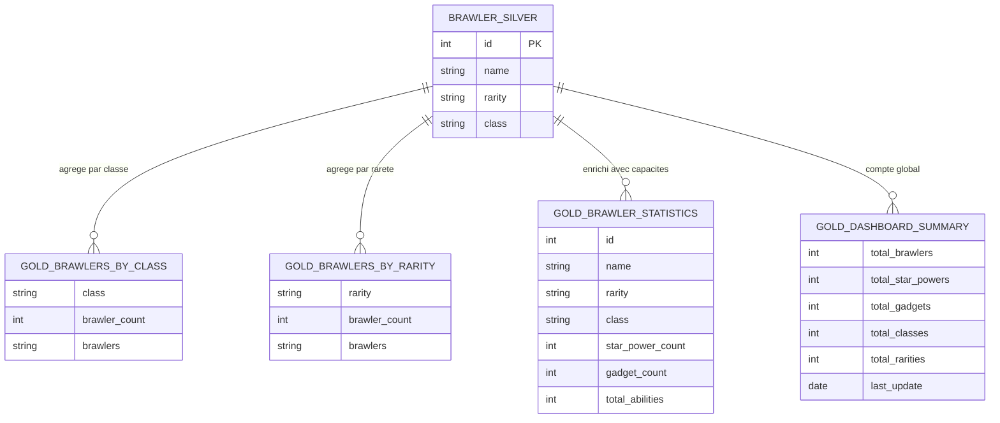

# Brawl Stars Data Mining

Projet de data mining avec architecture Bronze / Silver / Gold.
Les données proviennent de l'API publique Brawlify (données du jeu Brawl Stars de Supercell).

---

## Architecture Medallion

```
API Brawlify
    |
    v
BRONZE  --> bronze_raw (JSON brut stocké en base)
    |
    v
SILVER  --> brawler, star_power, gadget (tables normalisées)
    |
    v
GOLD    --> gold_* (vues analytiques SQL)
    |
    v
VISUALIZE --> graphiques PNG + dashboard HTML interactif
```

---

## Prérequis

- Python 3.8+
- XAMPP (MySQL/MariaDB) démarré sur le port 3306

---

## Installation

1. Installer les dépendances Python :

```bash
pip install requests mysql-connector-python pandas matplotlib seaborn plotly
```

2. Ouvrir XAMPP et démarrer MySQL.

3. Initialiser la base de données :
   - Ouvrir phpMyAdmin : http://localhost/phpmyadmin
   - Importer le fichier `init_database.sql`

---

## Utilisation

```bash
python main.py
```

Le pipeline s'execute en 4 étapes automatiquement :
1. Extraction des données depuis l'API (couche Bronze)
2. Normalisation en tables relationnelles (couche Silver)
3. Création des vues analytiques (couche Gold)
4. Génération des graphiques et du dashboard (visualisations)

Les fichiers de sortie sont dans le dossier `visualizations/`.

---

## Structure du projet

```
projet/
├── main.py                  # Lance le pipeline complet
├── extract_bronze.py        # Appelle l'API et stocke le JSON brut
├── transform_silver.py      # Normalise les données en tables
├── transform_gold.py        # Crée les vues analytiques SQL
├── visualize_gold.py        # Génère les graphiques et le dashboard
├── init_database.sql        # Script SQL d'initialisation
├── requirements.txt         # Dépendances Python
└── visualizations/          # Dossier de sortie (créé automatiquement)
    ├── brawlers_by_class.png
    ├── brawlers_by_rarity.png
    ├── abilities_analysis.png
    ├── heatmap_abilities.png
    ├── interactive_dashboard.html
    └── summary_report.txt
```

---

## Modele de données

### Schema (MCD)

### Bronze

| Table | Description |
|-------|-------------|
| `bronze_raw` | Stockage du JSON brut retourné par l'API |

### Silver (tables normalisées)

| Table | Description |
|-------|-------------|
| `brawler` | Un brawler par ligne (id, name, rarity, class) |
| `star_power` | Star powers liés à un brawler |
| `gadget` | Gadgets liés à un brawler |

### Gold (vues analytiques)

| Vue | Description |
|-----|-------------|
| `gold_brawlers_by_class` | Nombre de brawlers par classe |
| `gold_brawlers_by_rarity` | Nombre de brawlers par rareté |
| `gold_brawler_statistics` | Statistiques complètes par brawler |
| `gold_gadgets_per_brawler` | Nombre de gadgets par brawler |
| `gold_star_powers_per_brawler` | Nombre de star powers par brawler |
| `gold_dashboard_summary` | Métriques globales |

---

## Modele Gold — Expression des besoins metiers

### Contexte métier

L'API Brawlify expose les données du jeu Brawl Stars (Supercell). L'objectif de la couche Gold est de répondre à des **questions analytiques concrètes** sur l'équilibre du jeu et la composition du roster de brawlers.

---

### Questions métier auxquelles répond la couche Gold

| # | Question métier | Vue Gold |
|---|-----------------|----------|
| 1 | Quelle est la répartition des brawlers par classe de jeu ? | `gold_brawlers_by_class` |
| 2 | Quelle est la répartition des brawlers par rareté ? | `gold_brawlers_by_rarity` |
| 3 | Quels brawlers ont le plus de gadgets disponibles ? | `gold_gadgets_per_brawler` |
| 4 | Quels brawlers ont le plus de star powers disponibles ? | `gold_star_powers_per_brawler` |
| 5 | Quels brawlers ont le plus de capacités au total ? | `gold_brawler_statistics` |
| 6 | Quels sont les indicateurs globaux du jeu ? | `gold_dashboard_summary` |

---

### Schema du modele Gold



---

### KPIs produits

| KPI | Description | Source |
|-----|-------------|--------|
| Nombre total de brawlers | Taille du roster complet | `brawler` |
| Répartition par classe | Fighter, Tank, Support, Assassin, Marksman, Controller, Hybrid | `brawler.class` |
| Répartition par rareté | Trophy Road, Rare, Super Rare, Epic, Mythic, Legendary, Chromatic | `brawler.rarity` |
| Brawlers avec 2 star powers | Brawlers au kit complet | `star_power` |
| Brawlers avec 2 gadgets | Brawlers au kit complet | `gadget` |
| Total capacités par brawler | Indicateur d'équilibre du kit | `star_power` + `gadget` |
| Dernière mise à jour | Fraîcheur de la donnée | `bronze_raw.extraction_date` |

---

## Technologies

| Outil | Usage |
|-------|-------|
| Python | Langage principal |
| MySQL / MariaDB (XAMPP) | Base de données |
| requests | Appels HTTP vers l'API |
| pandas | Manipulation des données |
| matplotlib / seaborn | Graphiques statiques |
| plotly | Dashboard interactif HTML |

---

## Auteur

ESGI - Data Mining en Python
