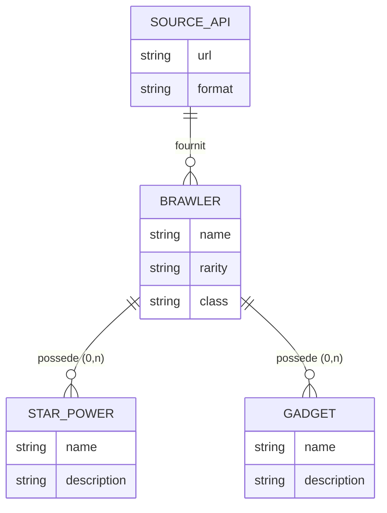
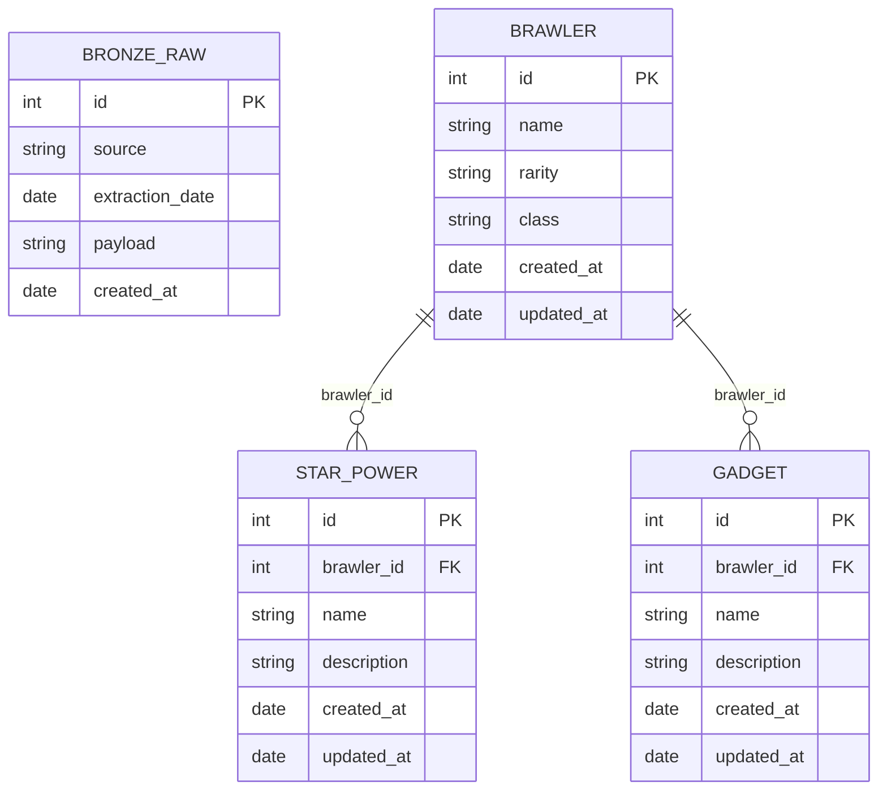

# Schema de données

## MCD - Modele Conceptuel de Données

---

## MLD - Modele Logique de Données

---

## Regles de gestion

- Un brawler peut avoir 0, 1 ou 2 star powers
- Un brawler peut avoir 0, 1 ou 2 gadgets
- Les star powers et gadgets sont toujours rattaches a un brawler (FK obligatoire)
- La couche Bronze stocke le JSON brut sans transformation
- Les couches Silver et Gold sont construites a partir du Bronze
